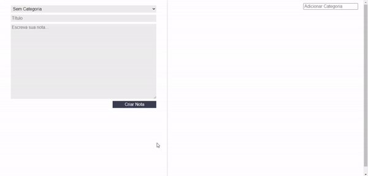

# Notas

Projeto criado em um dos cursos de React da Alura para aprender sobre como a biblioteca funciona e ciclo de vida dos componentes. <br />

Nele aprendi: <br />

A criar class components dentro do React;
A como passar informações entre os componentes;
Como o "this" funciona dentro do Javascript;
Sobre o ciclo de vida dos componentes React;
A diferença entre Statefull e Stateless components.

# Overview



# How to run

```
# Clone this repository
$ git clone https://github.com/velleeda/Notas

# Go to the directory
$ cd Notas

# Install Dependencies
$ npm install

# Run Web Server
$ npm start
```
